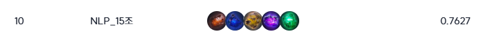
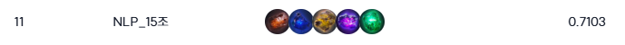

# 수능형 문제 풀이 모델 생성

## 📕프로젝트 개요

- 부스트캠프 AI Tech `NLP` 트랙에서 개체된 level 2 대회
- `수능형 문제 풀이 모델 생성` Task.
  - '한국어'와 '시험'이라는 주제에 맞춰서 작은 모델을 제작해 수능 시험을 풀어보는 도전
- 학습 데이터셋은 `KMMLU / MMMLU(Ko) / KLUE MRC`중 2031개, 평가 데이터는 `수능형 문제 + KMMLU / MMMLU(Ko) / KLUE MRC` 총 869개로 평가 데이터 중 50%만 Public으로 반영 대회 종료 후 Private 점수가 공개됨.
- [Wrap-Up Report](./lv3_wrapup_report.pdf)

### 데이터 셋 구조
#### 헤더와 설명
- **id**: 데이터 항목의 고유 식별자
- **paragraph**: 지문 (문제 해결에 필요한 텍스트)
- **problems**: 문제 정보 (딕셔너리 형태로 저장)
- **question_plus**: 보기 (추가적인 질문 정보)

---

#### `problems` 키와 값
- **question**: 질문 내용
- **choices**: 선지 (다중 선택지, 리스트 형식)
- **answer**: 정답 (선지 리스트의 인덱스, 정수 값)

---

#### 데이터 예시
```json
{
    "id": 1,
    "paragraph": "상소를 올린 조선 시대 인물에 관한 설명입니다.",
    "problems": {
        "question": "상소한 인물이 속한 붕당에 대한 설명으로 옳은 것만을 모두 고르면?",
        "choices": ["ㄱ, ㄴ", "ㄱ, ㄷ", "ㄴ, ㄹ", "ㄷ, ㄹ"],
        "answer": 2
    },
    "question_plus": "보기: ㄱ. 학문 중심의 집단, ㄴ. 정치 세력 중심, ㄷ. 개혁 지향적, ㄹ. 보수적"
}

```

## 😁팀소개

<table style="width: 100%; text-align: center;">
  <tr>
    <th><a href="https://github.com/privetin">김정석</a></th>
    <th><a href="https://github.com/jduck301">서재덕</a></th>
    <th><a href="https://github.com/son0179">손익준</a></th>
    <th><a href="https://github.com/WHY1862">원호영</a></th>
    <th><a href="https://github.com/LeSaUi">이상의</a></th>
  </tr>
</table>

## 📆세부일정
- 프로젝트 기간(2주) : 11.13(수) ~ 11.28(목)
- 강의 수강 및 과제 진행: 11.11(월) ~ 11.14(목)

## 프로젝트 주요 모듈
- **Quantization**
- **Prompt Engineering**
- **RAG**
- **Model Merging**

## 프로젝트 아키텍쳐
Quantization, Hint Generation, Model Merging, Question Classification, RAG 

## 프로젝트 결과
### Baseline


### Mid


### Final


## Usage
### Requirements
```bash
pip install -r requirements.txt
```

### Command
```bash
cd ./generative/src
python run.py
```

# Appendix
## 개발 환경
### 하드웨어
- **aistage docker server**: 훈련과 대규모 실험을 수행하며, 제한된 자원 내에서 효율적인 자원 활용을 위해 분산 실험 진행. 총 4대.
    - GPU : NVIDIA V100 32GB
    - HDD : 100GB

### 소프트웨어
- **Python 3.10**
- **PyTorch 2.5**
- **HuggingFace**
- **LangChain**
- **DVC**
- **Jupyter Notebook**

### 협업 및 프로젝트 관리 도구
- **GitHub**: 코드 버전 관리 및 협업. GitHub Flow를 통해 기능 단위로 브랜치를 관리하고, 코드 리뷰를 진행.
- **Notion**: 팀 회의록, 실험 결과 기록, 프로젝트 진행 상황 문서화에 사용.
- **Slack & Zoom**: 팀원 간의 원활한 커뮤니케이션 및 화상 회의 도구.
- **pre-commit**: 코드 품질 유지와 자동화된 검사를 위해 사용. 코드 스타일 검사, 포맷팅, 정적 분석 등을 Git 커밋 단계에서 실행하여 일관성을 유지.

## 추가 참고 문헌 및 자료
